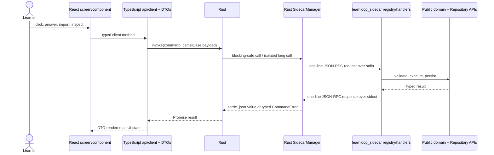

# Desktop Architecture

The desktop application is a React/TypeScript presentation client inside a Tauri/Rust shell. It does not reimplement the learning algorithm or open `state.sqlite` as an application database. User actions cross a four-layer bridge to the Python sidecar, whose public handlers call the same domain and persistence APIs documented in [[Architecture Overview]].

## Four-layer bridge



The difficult invariant is registration continuity: a frontend `invoke` must have a registered Rust command, and that command must delegate to a registered Python sidecar method. `tests/test_desktop_rpc_contract.py` checks all four layers as sets so a method cannot exist on only one side. ^desktop-rpc-bridge

## Layer ownership

| Layer | Primary sources | Owns | Must not own |
|---|---|---|---|
| React application | `src/app`, `src/screens`, `src/components` | navigation, overlays, drafts, visual state, accessibility/input behavior | grading, scheduling, SQL, provider protocol |
| TypeScript API/DTO | `src/api/client.ts`, `src/api/dto.ts` | command names, request/response types, Tauri invocation; per-mutation cache invalidation tags (`mutating*` wrappers) | domain interpretation or persistence |
| Query cache | `src/api/queryCache.ts`, `src/api/useCachedQuery.ts`, `src/api/queryTags.ts`, `src/components/pdfDocumentCache.ts` | stale-while-revalidate memo of sidecar reads keyed by `[command, ...args]`, tag invalidation, `clear()` on vault switch, one in-flight request per key | authority over any state (the sidecar snapshot is; a cached value is never trusted past its next revalidation) |
| Tauri host | `src-tauri/src/main.rs`, `commands.rs` | native window/protocol/plugin setup, command registration, blocking boundary | learning policy |
| sidecar process manager | `src-tauri/src/sidecar.rs` | Python process lifecycle, request ids, timeouts, reconnect, isolated long calls | silently retrying outcome-unknown mutations |
| Python sidecar | `src/learnloop_sidecar` | protocol validation/serialization and delegation | adapter-specific learning forks |

Use [[Desktop Module Catalog]] for every TypeScript/TSX/Rust file, its importers, tests, and modification guidance. Use [[Adapter Architecture]] for the boundary shared with CLI and TUI.

## Application composition

`main.tsx` applies the saved palette and mounts `App`. `App.tsx` is the desktop composition root: it loads the selected vault, maintains top-level screen/overlay/session state, listens for native vault-change events, and routes typed DTOs into screens. Screen modules own page-level interactions; components own reusable presentations; `api/client.ts` is the only ordinary route to native commands.

The UI keeps ephemeral interaction state—open overlays, current tab, local draft mirror—but the authoritative attempt, queue, ingest, goal, and learner state remains behind the sidecar. Reloading the UI must reconstruct supported state from backend snapshots and checkpoints.

## Sidecar lifecycle and concurrency

`SidecarManager` launches the Python server with piped stdin/stdout, sends `rpc.ping`, initializes it against a selected vault, and preserves that vault across a transport restart. Typed application errors keep the client alive; broken pipes, malformed protocol boundaries, or timeouts invalidate it so the next request starts a clean process.

The primary process is serialized behind a mutex for interactive calls. Long-running commands use an isolated initialized sidecar so an ingest/build operation cannot occupy the interactive client's mutex. A timed-out mutation is reported as outcome unknown; the shell does not guess that retry is safe.

> [!important] One job manager per selected vault
> Vault switching shuts down the previous sidecar before initializing the next. This prevents two desktop-owned durable job managers from acting on the same selected vault.

## Filesystem refresh

Rust's `vault_watcher` coalesces create/modify/remove bursts for Markdown, YAML, TOML, and JSON under the active vault. It ignores runtime/build/raw-original paths, sends normalized relative paths to Python's `refresh_vault_files`, and emits `learnloop://vault-files-changed` back to React.

Python remains the authority for incremental versus full refresh. A backend rescan/error or directory-only mutation deliberately selects the conservative full-refresh arm. Read events do not feed back into another refresh loop.

Every `learnloop://vault-files-changed` event whose mode is not `noop` also marks the whole query cache stale (coalesced to one invalidation per quiet second, since ingests write in bursts); mounted screens keep painting their cached data while they revalidate. SQLite-only mutations are invisible to the watcher, so each mutation wrapper in `client.ts` names the tags it affects — a new RPC that writes state must pick its tags there, and a new cached read must declare the tags that cover it. The Reader's per-source reads are the one sanctioned imperative use of `getOrFetch` (its open sequence has side effects); everything else reads through `useCachedQuery`. The Start screen's `list_vault_epigraphs` read is tagged `sources` + `vault`: its rows are written by synthesis jobs whose Markdown writes trip the watcher, while the row insert itself is SQLite-only and invisible to it, so the mount-time revalidation (`staleAfterMs` 0) is the backstop.

## Native capabilities and trust boundaries

- Tauri dialog/opener plugins provide explicit native file selection and opening.
- The `llpdf://` custom protocol serves content-addressed vault originals to the PDF reader without making arbitrary filesystem paths a web URL.
- Provider credentials are resolved by the backend environment/config machinery; React DTOs do not become a secret store.
- `SqliteBrowser` is an owner-gated maintenance surface; normal screens use domain RPCs rather than arbitrary SQL.
- DTOs are transport contracts, not domain authorities. See [[Privacy and Trust Boundaries]].

## Larger workflows

- [[Initialize a Vault]] — `NewVaultWizard` calls the same bootstrap lifecycle and selects the result.
- [[Import Canonical Sources]] / [[Build a Study Map]] — ingest, library, outline, proposal, and study-map screens orchestrate durable backend jobs.
- [[Start a Learning Cycle]] / [[Continue a Learning Cycle]] — Today, Practice, Feedback, Review, repair, and diagnostic overlays present the shared session/attempt APIs.
- [[Reader to Practice Workflow]] and [[Tutor and Teach-Back Workflow]] — dedicated screens/components render source-grounded interactions.
- [[Inspect Persistent State]] / [[Doctor Migrations and Recovery]] — maintenance views expose supported reports and explicitly gated operator tools.

The workflow notes own user procedure. Desktop module notes point here and to those workflows rather than restating the learning algorithm.

## Tests and build checks

```bash
cd apps/learnloop-tauri
npm run typecheck
npm run frontend:build
cargo test --manifest-path src-tauri/Cargo.toml

cd ../..
.venv/bin/pytest -q tests/test_desktop_rpc_contract.py tests/test_sidecar_contract.py tests/test_sidecar_serializer_snapshot.py
```

- TypeScript checks component/client/DTO coherence.
- Rust tests cover watcher/path/transport behavior colocated with the modules.
- the desktop RPC contract pins frontend → Rust registration → sidecar method continuity;
- sidecar contract and golden serializer tests pin backend results visible to the client.

## Modification guide

- New learning behavior: change the owning Python domain first, then add a public sidecar method and the narrow client surface.
- New desktop RPC: update Python registry/handler, Rust command declaration and handler list, TypeScript client, DTO, and `test_desktop_rpc_contract.py` atomically.
- New screen: keep orchestration in the screen, reusable rendering in a component, and persistence behind the client.
- Long-running work: use the isolated sidecar boundary or durable backend job APIs; do not block the primary interactive mutex.
- New watched file type/path: change Rust filtering and Python refresh semantics together; test that reads/runtime artifacts cannot create loops.
- Public response changes: update the sidecar serializer snapshot and affected DTOs before UI rendering.

## Related notes

- [[Desktop Module Catalog]]
- [[Adapter Architecture]]
- [[Architecture Overview]]
- [[Privacy and Trust Boundaries]]
- [[AI Architecture]]
